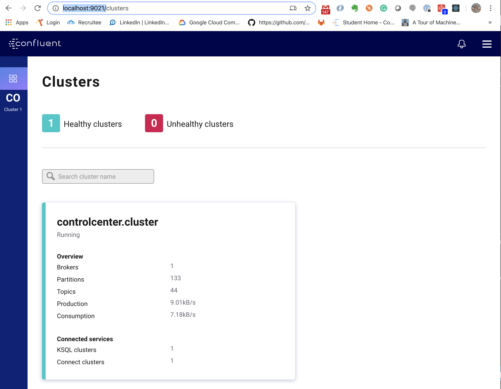
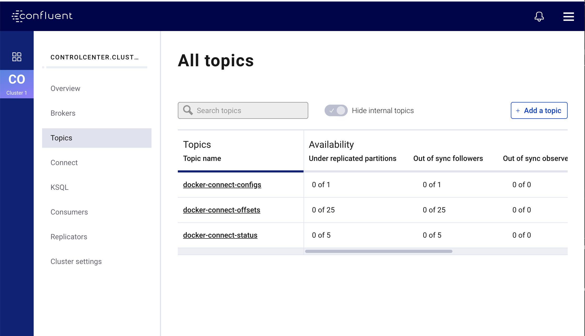
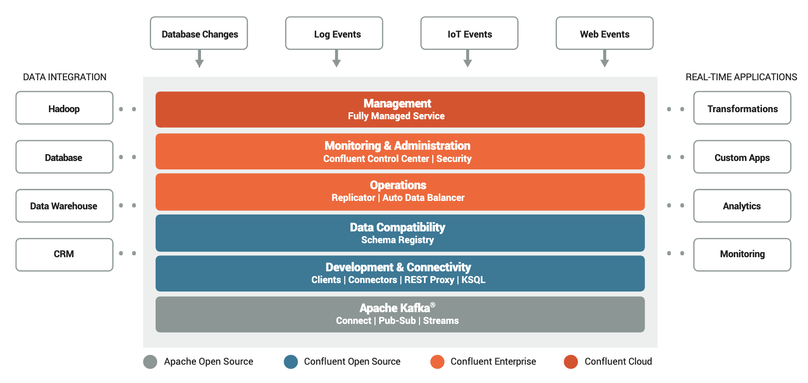

[Next Lab](https://github.com/axonxai/kafka101_workshop/blob/master/lab_02/readme.md)

# LAB-01 Maak een Kafka "hello world" producer en een consumer

**Doel:** In dit lab gaan we aan de slag met Kafka, we zullen met tooling en als laatste stap met een simpel Java programma maken om berichten van en naar Kafka te sturen.

(tooling nodig: docker, docker-compose, git, java, IDE, terminal)

In huiswerk opdracht had je al de Confluent repo opgehaald, we gaan nu onze Kafka setup draaien.

Open een terminal, voer de volgende commando's uit:

    $ git clone https://github.com/confluentinc/examples.git
    $ cd examples/cp-all-in-one
    $ docker-compose up


je ziet een hoop gepruttel, dit is goed :) 

Controleer of je ongeveer dezelfde output ziet als hieronder met het volgende docker commando

    $ docker ps

    docker ps
    CONTAINER ID        IMAGE                                             COMMAND                  CREATED             STATUS                             PORTS                                        NAMES
    1a3778716a1c        confluentinc/cp-ksql-cli:5.4.0                    "/bin/sh"                29 seconds ago      Up 27 seconds                                                                   ksql-cli
    0e20ef5888ff        confluentinc/ksql-examples:5.4.0                  "bash -c 'echo Waiti…"   29 seconds ago      Up 27 seconds                                                                   ksql-datagen
    658957a5888f        confluentinc/cp-enterprise-control-center:5.4.0   "/etc/confluent/dock…"   29 seconds ago      Up 27 seconds                      0.0.0.0:9021->9021/tcp                       control-center
    a15831bc609a        confluentinc/cp-ksql-server:5.4.0                 "/etc/confluent/dock…"   29 seconds ago      Up 29 seconds (health: starting)   0.0.0.0:8088->8088/tcp                       ksql-server
    fa36274f07c5        cnfldemos/cp-server-connect-datagen:0.2.0-5.4.0   "/etc/confluent/dock…"   30 seconds ago      Up 29 seconds                      0.0.0.0:8083->8083/tcp, 9092/tcp             connect
    ec2125ee2bcd        confluentinc/cp-kafka-rest:5.4.0                  "/etc/confluent/dock…"   30 seconds ago      Up 29 seconds                      0.0.0.0:8082->8082/tcp                       rest-proxy
    a023e2131d25        confluentinc/cp-schema-registry:5.4.0             "/etc/confluent/dock…"   31 seconds ago      Up 30 seconds                      0.0.0.0:8081->8081/tcp                       schema-registry
    6cd1525b11b0        confluentinc/cp-server:5.4.0                      "/etc/confluent/dock…"   31 seconds ago      Up 31 seconds                      0.0.0.0:9092->9092/tcp                       broker
    622f3950c8d0        confluentinc/cp-zookeeper:5.4.0                   "/etc/confluent/dock…"   33 seconds ago      Up 31 seconds                      2888/tcp, 0.0.0.0:2181->2181/tcp, 3888/tcp   zookeeper


We draaien nu het Confluent Kafka platform, laten we even kijken naar de extra's binnen deze opzet:

Open een browser met: http://127.0.0.1:9021

Je ziet nu het Control-Center en kunt alles over het Kafka cluster bekijken:



Kijk of het cluster al "healhty" is, klik daarna links op het cluster om daar de details te bekijken:




In de volgende plaat, kun je het verschil zien tussen Kafka, Open Source Confluent Kafka, Confluent Kafka platform:




## We gaan nu aan de slag met Kafka 
Open een nieuwe terminal en clone deze git-repo:

    $ git clone git@github.com:axonxai/kafka101_workshop.git

of download de zip: https://github.com/axonxai/kafka101_workshop/archive/master.zip

## Berichten sturen met de CLI

Ondanks dat Kafka default staat ingesteld om automatisch een topic aan te maken indien die nog ontbreekt, is het een 'best practice' om topic klaar te zetten, je hebt dan de mogelijkheid om je replicatie en andere properties in te stellen per topic.

Start met volgende cmd een container met de kafka tooling op in hetzelfde netwerk als onze andere containers:

    $ docker run -ti --net=cp-all-in-one_default bvoudenaarde/kafkatools:latest

Binnen deze container kunnen we nu alle CLI cmd uitvoeren:

### Een topic creëren, doen we op de volgende manier
    $ kafka-topics --zookeeper zookeeper:2181 --create --replication-factor 1 --partitions 1 --topic hello_world

Als het goed is zie je nu je aangemaakte topic (met een hoop al bestaande internal topic):

    $ kafka-topics --zookeeper zookeeper:2181 --list

### Een bericht sturen

    $ kafka-console-producer --broker-list broker:29092 --topic hello_world
    > hallo

Nu kun je een reeks berichten sturen naar dit topic, je krijgt een prompt > en zolang je niet op <ctrl>-c drukt blijf je berichten sturen.

### Een bericht bekijken
Open nu een nieuwe terminal en start een consumer met:

    $ kafka-console-consumer --bootstrap-server broker:29092 --topic hello_world 

Nu kun je het topic uitlezen en komen hier nieuwe berichten voorbij. 
Als je alle berichten wilt zien voeg je `--from-beginning` toe aan het commando. 

We stoppen nu de container met ctrl-c, je bent weer terug in je terminal.

We hebben nu de standaard Kafka tooling gebruikt om berichten te sturen en uit te lezen uit een topic, als laatste onderdeel in dit lab gaan we dit nu doen met een stukje Java. 

```Note: de antwoorden staan ook in het zelfde lab, mocht je vastlopen kun je hier spieken.```

## Let's code: een Producer in Java

Open je favoriete editor en importeer de producer-directory,

Gebruik voor de oefeningen de JavaDocs van Confluent Kafka: https://kafka.apache.org/0100/javadoc/index.html?index-all.html

Als het goed is zie je nu de structuur van een 'Maven' project met de code onder de src-directory. Ga naar src/main/java/ai.axonx.workshop.Producer.java

Volg de inststructies op in de punten in deze class, voor het ip adres gebruiken we nu localhost, mocht je onder virtualbox draaien dan kun je of via DOCKER_HOST_IP of een NAT rule maken om vanuit je laptop een connectie te maken richting de brokers

Als je klaar bent met de changes dan kun je alles via je IDE compileren of handmatig compileren in een terminal met:

    $ mvn clean install

Er wordt een 'Fat' jar gebouwd, die je direct kan runnen. Start het java programma met:


    $ java -jar ./target/MyProducer-1.0-SNAPSHOT-jar-with-dependencies.jar


## Let's code: een Consumer in Java

Hetzelfde als Producer lab, volg de instructies op in de code en zie de berichten van de Producer nu via de Consumer in de console output geprint. Ook nu weer is via Maven een 'Fat' jar beschikbaar.

    $ java -jar ./target/MyConsumer-1.0-SNAPSHOT-jar-with-dependencies.jar

Nu we een idee hebben hoe we met Java een producer/consumer kunnen maken, gaan we verder met onze ontdekkingstocht rond Kafka :)
 
 [Next Lab](https://github.com/axonxai/kafka101_workshop/blob/master/lab_02/readme.md)


