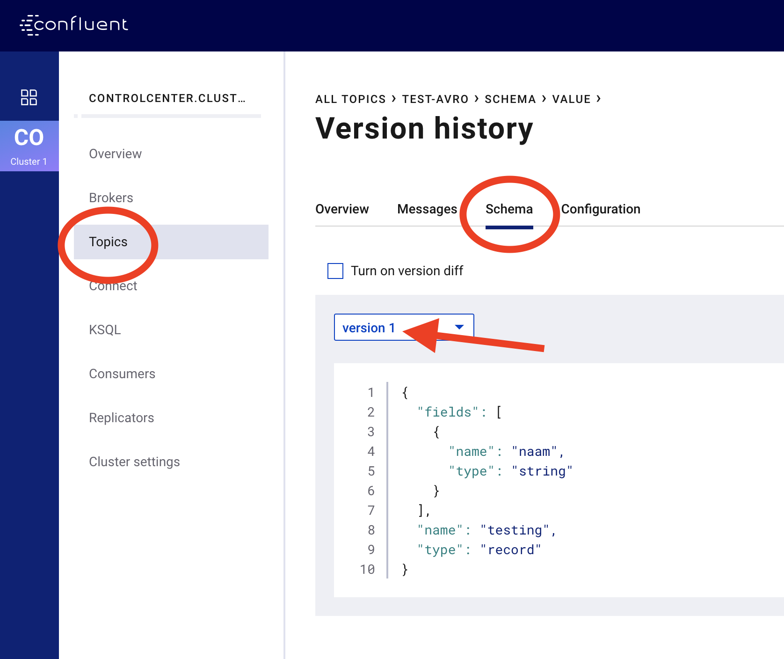
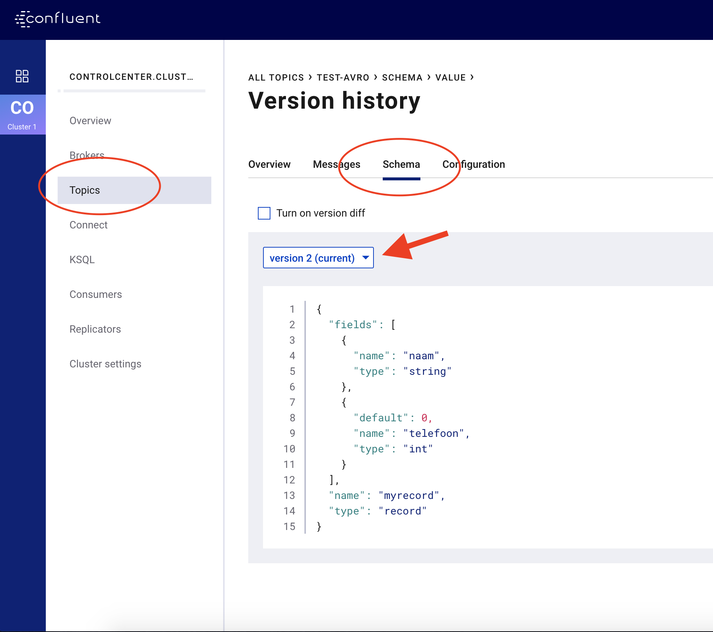

[Previous Lab](https://github.com/axonxai/kafka101_workshop/tree/master/lab_02) | [Next Lab](https://github.com/axonxai/kafka101_workshop/tree/master/lab_04)

# LAB-03 Avro schema's, met Twitteren met Avro Producers/Consumers

**Doel:** Handson met Avro schema's voor event messaging

 - Avro schema's opstellen
 - Avro serialization gebruiken met Kafka

Een Kafka broker houdt zich bezig met streaming van de events en doet zelf geen inspectie van de data die over de topics wordt verstuurd (geen CPU processing). Sterker nog, Kafka pakt de streaming data, maar niet in memory (ZERO-COPY concept) en dit alles je raadt het al voor de snelheid!

Dus Kafka handelt in bytes-streams en past geen verificatie toe. Dit is uiteindelijk wel wenselijk en kunnen we realiseren met de Kafka Registry, maar eerst even meer over de bytes-streams en schema's.

Als je binaire data tussen 2 partijen over de 'wire' wilt sturen (serializing/deserializing)  moet je beschrijven met een data format hoe je data types eruit zien (encoding/decoding). 

Voorbeeld wij willen het getal '8431' oversturen, als we in Kafka geen schema's gebruiken wordt alles omgezet naar String, dus het karakter '8' in utf-8 heeft standaard 2 bytes nodig, enz dus totaal 8 bytes. Met een dataformat geef je aan dit is een getal en 8431 wordt dan in 1 Integer (32 bits), dus 4 bytes overgestuurd. Dit scheelt dus 4 bytes!
Als het volume of de grootte van de berichten toenemen, dan zie je de voordelen van het gebruik van slimme encoding. 

Binnen Kafka is gekozen voor Avro. Avro encoding is beschreven als een JSON schema, en heeft de volgende voordelen:
- Data is fully typed
- Data is compressed 
- Schema (JSON) komt met de data
- Documentatie is onderdeel in het schema
- Data language agnostic (geen harde binding met een bepaalde taal)
- Schema evolution, mechanisme om veranderingen in de data toe te staan 

In vorige versies vond validatie op de edge's en dus niet in Kafka. In het v5.4 Confluent Platform zijn nu wel validaties ingebakken, zie https://docs.confluent.io/current/schema-registry/schema-validation.html#schema-validation

## Avro Record Schema structuur
Een Avro schema heeft een record structuur als volgt:

    Name 
    Namespace
    Doc
    Aliases
    Fields
       Name
       Doc
       Type

voorbeeld:

    {
        "type": "record",
        "namespace": "ai.axonx.workshop",
        "name": "tweet",
        "fields": [
            { "name": "body", "type": "string" },
            { "name": "id", "type": "int"}
        ]
    }

Bovenstaande record voorbeeld noemen we een Avro Schema en wordt als een file met extensie .avsc opgeslagen.

## Avro Primitive Types

We kennen de volgende types voor de fields elementen:

    null : geen waarde
    boolean
    int  : 32 bits signed
    long : 64 bits signed
    float: 32 bits 
    double : 64 bits
    byte : 8 bits
    string : unicode

## Avro Complex Types
  
    enums  =>  { "name": "build_success", "type": "enum", "symbols": ["ROOD", "GROEN"] }
    arrays =>  { "name": "relations", "type": "array", "items": "string" }
    maps   =>  { "name": "hashmap", "type": "maps", "values": "string" }
    unions =>  { "name": "tussenvoegsel", "type": ["null", "string"], "default": null }   
    type is een ander schema (incl namespace)

    **Let op:** default waarde type is gelijk aan eerste type union!

## Logical Types

    decimals (bytes)        : geld 
    date (int)              : aantal dagen sinds 1970 
    time-millis (long)      : millisec na midnight
    timestamp-millis (long) : millisec sinds 1970

Voorbeeld gebruik logical type voor onze tweets: 

    {"name": "tijd_tweet", "type": "long", "logicalType": "timestamp-millis"}

### ***Oefening 1 Maak een Avro schema***

Check Tweet Object op: https://developer.twitter.com/en/docs/tweets/data-dictionary/overview/tweet-object.html

Onder lab_03 in de directory avro-oefening1 vind je een leeg schema. Vul dit Avro schema aan, gebruik uit het orginele Tweet Object de volgende attributten:

    created_at
    text
    favorite_count

over te nemen in het avro schema en let op types!

We zullen dit nu onze V1 (version 1) noemen van onze Tweet Stream berichten.

We gaan nu een uitbreiding van schema V1, dit doen we even in een aparte file zie in dezelfde directory.

Voeg de volgende attributten toe:

    lang
    retweeted

Maar, let op zorg er voor dat ze een default waarde hebben, bedenk zelf een logische default waarde.

### ***Oefening 2 Backward, Forward, Full compatible schema changes***

We hebben nu 2 schema's gemaakt maar zijn ze compatible? Hoe regel je dit eigenlijk? Verder waar vindt de validatie plaats?

We beginnen bij validatie, open 2 terminals. Op de eerste terminal, tik en op de prompt kun je berichtjes naar het topic sturen, het eerste bericht volgens het schema, daarna 2 foutieve berichten (je moet na de foutmedling het commando nog een keer uitvoeren):

    $ kafka-avro-console-producer --broker-list broker:29092 --topic test-avro --property schema.registry.url=http://schema-registry:8081 --property value.schema='{"type":"record","name":"testing","fields":[{"name":"naam","type":"string"}]}'

    > {"naam": "Pietje Puk"}
    > {"bla": "Pietje Puk"}
    > {"naam": 1000}

Check nu via Control Center onder je topic de schema info is toegevoegd, open je browser op 127.0.0.1:9021

Nu een schema evolutie, (er is dus per topic een current schema geldig), wederom een goed bericht en fout bericht:

    $ kafka-avro-console-producer --broker-list broker:29092 --topic test-avro --property schema.registry.url=http://schema-registry:8081 --property value.schema='{"type":"record","name":"myrecord","fields":[{"name":"naam","type":"string"},{"name": "telefoon", "type": "int", "default": 0}]}'

    > {"naam": "bas", "telefoon": 1234567890 }
    > {"naam": "bas", "telefoon": "1234567890" }

Check nu in Control Center de schema-tab, we zien nu 2 versie voor dit topic, waarvan de laatste nu leading is (default):

We hebben berichten op het topic 'test-avro' staan gemaakt onder de verschillende schema definities.

Nu met de consumer (indirect gebruik van het actuele schema) kunnen we alle berichten bewonderen, zowel v1 als v2 berichten!!!:

    $ kafka-avro-console-consumer --topic test-avro \
    --bootstrap-server broker:29092 \
    --from-beginning \
    --property schema.registry.url=http://schema-registry:8081

***Lessons Learned:***

Binnen de evelutie van schema's kennen we 4 soorten:
* Backward compatible  : we kunnen met het nieuwe schema v2 oude berichten van schema v1 lezen
* Forward compatible   : we kunnen met het oude schema v1 de nieuwe berichten van schema v2 lezen
* Full                 : Zowel Forward als Backward, dus berichten gemaakt onder schema's v1,v2 zijn te lezen met v1,v2 
* Breaking             : geen, dus je breekt je data flow.

Voorbeeld backward:
Scenario je hebt alle consumer en producer op v2 schema's gezet, de consumers nu met v2 schema's kunnen de oude data nog lezen.

    v1 schema: 
    {"type":"record","name":"myrecord","fields":[{"name":"naam","type":"string"}]}    

    v2 schema:
    {"type":"record","name":"myrecord","fields":[{"name":"naam","type":"string"},{"name": "telefoon", "type": "int", "default": 0}]}

    door default wordt in de oude v1 data, het telefoon nummer op 0 gezet

Voorbeeld forward:
Scenario je hebt alle producer op v2 schema's gezet, maar niet alle consumers kunnen direct over, er is een mix van v1,v2 consumer.

    v1 schema: 
    {"type":"record","name":"myrecord","fields":[{"name":"naam","type":"string"}]}    

    v2 schema:
    {"type":"record","name":"myrecord","fields":[{"name":"naam","type":"string"},{"name": "telefoon", "type": "int"]}

    voor een v1 consumer is het mogelijk om de nieuwe v2 data te lezen. In dit geval wordt het telefoonnumer ignored.

Voorbeeld Full, is eigenlijk geschetst in het backward scenario. Door defaults blijft het back als forward compatible.

Voorbeeld Breaking, 

v1 schema: 

    {"type":"record","name":"myrecord","fields":[{"name":"id","type":"int"}]}    

    v2 schema:
    {"type":"record","name":"myrecord","fields":[{"name":"id","type":"string"}]}

In de praktijk ga je voor FULL, met de volgende regels houd je 
* primary key velden zijn verplicht (geen default)
* default values voor alle velden die in de toekomst wellicht verdwijnen
* Bij gebruik van enums geen veranderingen in id
* Hernoem geen velden, gebruik een alias
* Een opvolgend schema gberuikt voor nieuwe velden altijd defaults
* In een opvolgend schema, delete nooit de required velden.

Met Kafka icm de registry en fully compatibele schema's kunnen verschillende compatible message naast elkaar draaien, producer kunnen al nieuwe berichten uitsturen waarbij nog niet alle consumers over moeten naar nieuwe schema's + functionaliteit, dit kunnen we gefaseerd aanpakken (geen big-bang scenarios). Voor volledig benutten van nieuwe structuur, lees data / info zullen de consumers uiteindelijk wel over moeten tot nieuwe schema + bijbehorende functionaliteit in de code.  Maar ook andersom Consumer kunnen al worden opgehoogd en oude producers kunnen nog steeds oude berichten aanleveren, ook hier kun je weer gefaseerd aan de slag.

Op deze manier kunnen we op een Agile manier onze Enterprises voorzien van nieuwe mogelijkheden!

### ***Oefening 3 Kafka Avro Producer***

Zoals we boven met de kafka-avro-console-producer/consumer hebben gespeeld, gaan we nu een versimpelde versie van Tweets icm avro validatie in Java uit proberen,

In Java kunnen we een avro schema omzetten in een Java POJO, die we dan kunnen invullen qua waardes:

    TweetLikes tweetLikes = TweetLikes.newBuilder()
                .setCreatedAt(12345678)
                .setLiked(455)
                .setText("tweet message")
                .build();

In de Kafka properties zowel voor de producer en consumer moeten we instellen voor avro decoding.

Fix eerst het avro schema in de resource folder met de volgende attributen:

    created_at
    text,
    liked

[Previous Lab](https://github.com/axonxai/kafka101_workshop/tree/master/lab_02) | [Next Lab](https://github.com/axonxai/kafka101_workshop/tree/master/lab_04)
